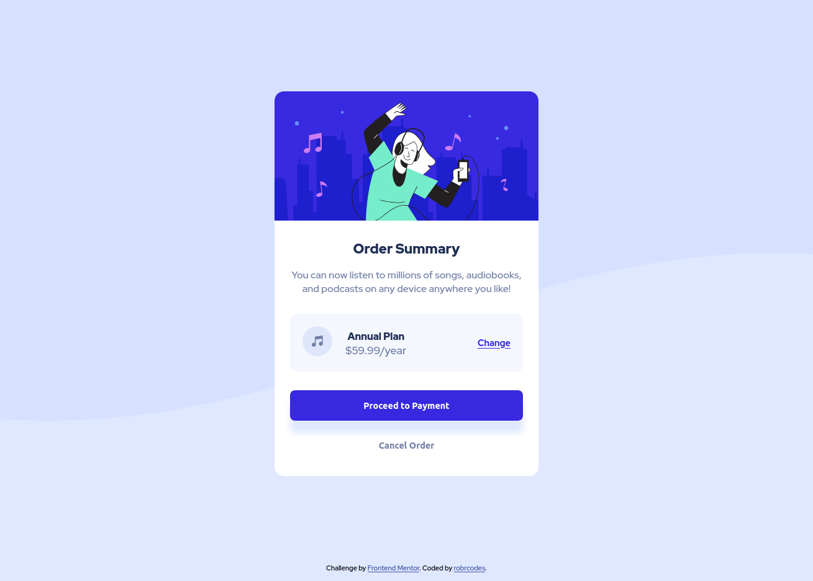

# Frontend Mentor - Order summary card solution

This is a solution to the [Order summary card challenge on Frontend Mentor](https://www.frontendmentor.io/challenges/order-summary-component-QlPmajDUj). Frontend Mentor challenges help you improve your coding skills by building realistic projects.

## Table of contents

- [Overview](#overview)
  - [The challenge](#the-challenge)
  - [Screenshot](#screenshot)
  - [Links](#links)
  - [Built with](#built-with)
  - [What I learned](#what-i-learned)
  - [Continued development](#continued-development)
- [Author](#author)

**Note: Delete this note and update the table of contents based on what sections you keep.**

## Overview

### The challenge

Users should be able to:

- See hover states for interactive elements

### Screenshot



### Links

- Solution URL: [Github link](https://github.com/robrcodes/order-summary-component)
- Live Site URL: [Live Link](https://robrcodes.github.io/order-summary-component/)

### Built with

- Mobile-first workflow
- Semantic HTML5 markup
- CSS custom properties
- Flexbox

### What I learned

Doing this challenge I learnt the practical application of flexbox for simple layout of a component, in this case the center section of the card containing the music icon and Plan details with change link.

Also how easy it is to link to Google Fonts:

```html
<link rel="stylesheet" href="style/style.css" />
<link rel="preconnect" href="https://fonts.googleapis.com" />
<link rel="preconnect" href="https://fonts.gstatic.com" crossorigin />
<link
  href="https://fonts.googleapis.com/css2?family=Red+Hat+Display:wght@500;700;900&display=swap"
  rel="stylesheet"
/>
```

Also learnt that an image needs to have border radius applied directly to it, as it will not just asume the border radius from it's container:

```css
.card {
  background-color: #ffffff;
  border-radius: 15px;
  width: 325px;
  margin: 0 auto;
}

.hero-img {
  width: 100%;
  border-top-left-radius: 15px;
  border-top-right-radius: 15px;
}
```

### Continued development

My next project/challenge I would like to use Grid for the layout.

## Author

- Website - [robrcodes](https://www.robr.codes)
- Frontend Mentor - [@robrcodes](https://www.frontendmentor.io/profile/robrcodes)
- Twitter - [@robrcodes](https://www.twitter.com/robrcodes)
